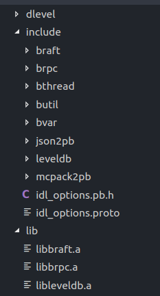
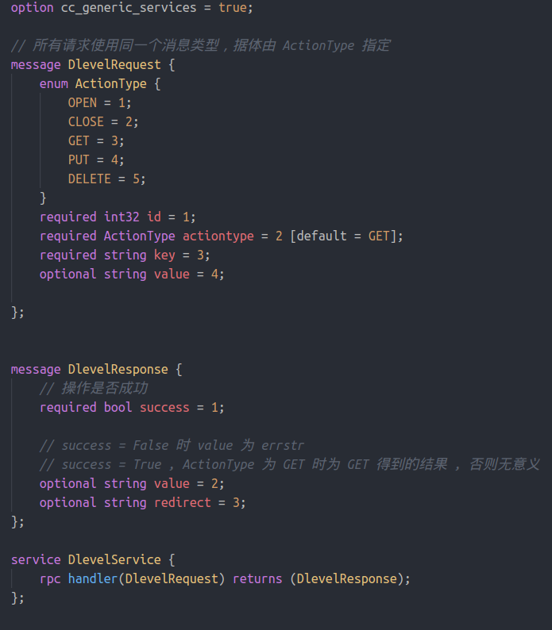
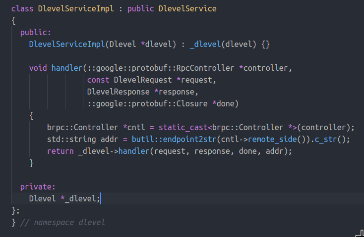
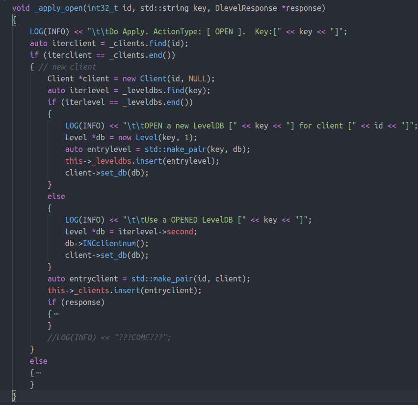
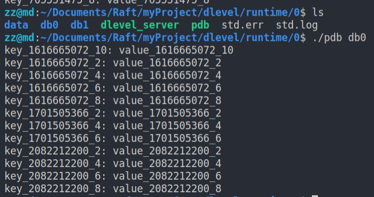

# levelDB 副本集的初步实现

在原来的基础上实现了客户端可以打开指定的 levelDB。粗略的实现了最基本的调用: open, get, put, delete, close。

# 1. 编译并运行

## 准备库

将 brpc 和 braft 的头文件和编译后的库文件分别复制到项目中的 include 和 lib 目录中。 cmake 中的这一行  `set(CMAKE_PREFIX_PATH "${CMAKE_SOURCE_DIR}/..")` 指定先在上面的两个目录中进行搜索。如果需要使用自己的 levelDB 或其他库，也可以直接复制到这里。复制完成后目录像这样：



## 编译

```
    cd dlevel
    cmake .
    make
```

除了 client 和 server， 还会得到 pdb (printdb.cpp)，用来遍历某个 levelDB 的全部内容，方便调试。

## 运行

可以直接运行
```
bash run_server.sh
bash run_client.sh
```
但是所有的 server 都运行在一个终端的后台且难以调试，所以对启动脚本进行了修改。

加上参数 `--cmd=1` 会得到启动的命令但并不执行，可以把命令复制到不同的终端中执行。`--cmd=1 --gdb=1` 可以生成用 gdb 启动的命令。

```shell
$ bash run_client.sh --cmd=1
raft peers: 192.168.0.120:8100:0,192.168.0.120:8101:0,192.168.0.120:8102:0,
./dlevel_client --bthread_concurrency=8 --conf=192.168.0.120:8100:0,192.168.0.120:8101:0,192.168.0.120:8102:0, --crash_on_fatal_log=true --thread_num=1 --use_bthread=true

$ bash run_server.sh --cmd=1
raft peers: 192.168.0.120:8100:0,192.168.0.120:8101:0,192.168.0.120:8102:0,
mkdir -p runtime/0 && cp pdb runtime/0 && cp ./dlevel_server runtime/0 && cd runtime/0 &&  ./dlevel_server -bthread_concurrency=18-crash_on_fatal_log=true -raft_max_segment_size=8388608 -raft_sync=true -port=8100 -conf="192.168.0.120:8100:0,192.168.0.120:8101:0,192.168.0.120:8102:0," 
mkdir -p .......
```

# 2. 主要实现方式

## rpc

所有 api 都通过同一个 rpc 服务实现(handler)， 在请求的 ActionType 中指定具体是哪一个操作， 每个请求都会带上客户的 id，用来区分 client  。proto 定义如下



## server 端

- Level  
  对每一个打开的 LevelDB, 维护一个数据结构 Level, 记录了打开它的客户端的数量等信息， 并封装对数据库了基本的操作。
- Client  
  对每一个打开了某个 levelDB 的客户端，维护一个数据结构 Client， 记录这个客户的 id, 指向 levelDB 的指针 db。
- DlevelServiceImpl  
  服务器端的 rpc 服务， 实现 proto 中定义的 handler 函数，并交给 Dlevel 的 handler 做进一步处理。
  
- Dlevel  
  代表 raft 中的节点。对请求执行具体的操作
  - Get 请求： 直接查询 leader 的 数据库并直接返回结果到 rpc
  - Open，Close, Put, Dlelete 请求： leader 将请求序列化成 task 并 apply 到所有节点。每个节点在 on_apply 函数中完成相应操作。
  
  Dlevel中使用两个 std::map 来记录 所有的 Client 和 Level
  ```
    std::map<int32_t, Client*> _clients;
    std::map<std::string, Level*> _leveldbs;
  ```
  例如， 对 open 的 on_apply 操作如下, key 为数据库的名字
  
  

## client 端

用一个类进行封装，提供 open, close, get, put, delete 接口。

用于测试的 main 函数会创建一个 client 并且随机的打开名为 `db0` 或者 `db1` 的数据库， 然后循环地进行 PUT GET DELETE 操作。k-v 对的内容为 （key\_这个客户的id\_序号， value\_这个客户的id\_序号）.  
同时执行多个客户端一段时间，可以看到每一个 server 都有两个数据库 db0 和 db1， 数据库中的 k-v 对如下



