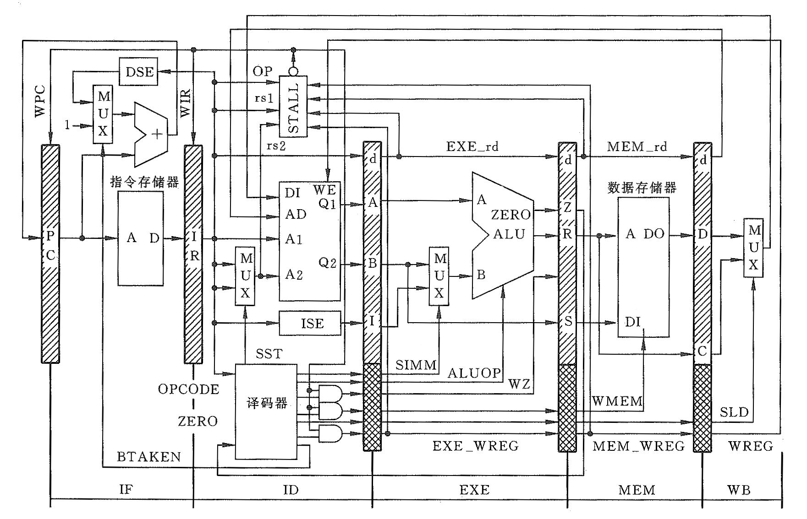

# 第一章 #

## Flynn's 分类 基于指令流和数据流数量的计算机体系结构分类 ##

1. SIDI 串行计算机  
    Single instruction 在任一时钟周期只有单个指令流在CPU执行  
    Single data 在任一时钟周期只有单个数据流作用输入  
2. SIMD 处理数据级并行  
    Single instruction 在任一时钟周期，所有处理单元执行相同的指令  
    Multiple data 每个处理单元能对不同数据元素进行操作  
3. MISD  
    每个数据流进入多个处理单元，每个处理单元用单个指令流对数据进行独立操作  
4. MIMD 并行计算机，线程级或请求级并行  
    Mutiple Instruction 每个处理器可以执行不同的指令流
    Multiple Data 每个处理器可以对不同的数据流进行操作

## 市场分类 ##

1. 个人移动设备 （成本、能耗、尺寸、性能、存储器优化）
2. 桌面计算机 （性价比）
3. 服务器 （可靠性、可扩展性、吞吐量）
4. 集群仓库级计算机 （性价比、吞吐量、可靠性）
5. 嵌入式计算机 （实时性能、资源限制）（区分嵌入式与非嵌入式：能否运行第三方软件）

## 计算机体系结构的概念 ##

原始概念： 由程序员（机器语言）看见的计算系统属性。即概念性的结构和功能性的行为，以区分数据流动和控制逻辑的组成及物理实现。
The attributes of a system as seen by the programmer, i.e, the conceptual structure and functional behavior, as distinct from the organization of the datat flows and controls the logic design, and the physical implementation.

现代定义： 在满足功能、性能、和价格目标的条件下、设计、选择和互连硬件部件构成计算机。

**`指令集`**   硬件与软件之间的接口

ISA 用途  

- 开发者与硬件之间的接口
- 这代芯片与下一代芯片的合同

ISA 的特征  

- 类型 通用寄存器、累计器等
- 存储器访问
- 寻址方式
- 操作数类型大小
- 操作类型 数据传输 算数逻辑
- 控制流指令 转移、调用返回
- ISA编码 固定长度、可变长度

## 实现技术的趋势 ##

- 技术阈值（Technology thresholds）对设计有重大影响实现技术在持续改进到阈值，就会使设计发生飞跃
- 带宽改进优于时延 带宽增加速度与时延平方改进速度成比例
- 对于多核，每瓦提供更多性能

## 可靠性的量化 ##

**`MTTF`** （mean time to failure） 平均无故障时间  
**`MTTR`** （mean time to repaire） 平均修复时间  
**`MTBF`** 平均故障间隔时间 MTBF = MTTF + MTTR  
**`FIT`** 故障率 1/MTTF  
**`模块可用性`**  MTTF/MTBF
  
提高可靠性的方法  冗余

- 时间冗余
- 资源冗余

## 测量性能 ##

比较性能的指标

- CPU时间、响应时间  
  1. 墙钟时间(响应时间)    [用户的感觉]  
    程序开始执行到结束看钟知道的时间，就是墙钟时间，用户感觉到的系统速度  
  2. CPU 时间   [设计者的感觉]  
        - 系统CPU时间 花费在OS的时间
        - 用户CPU时间 花费在用户模式的时间
- 吞吐量 单位时间内完成的工作量  [管理员的感觉]  
    测量管理员感觉到的系统性能  
    通常改善了响应时间也会改善吞吐量,只改善吞吐量而不改善响应时间

- MIPS Millions of Instructions per Second [商人的感觉]  
    用相同的指令集比较两台机器 (A, B), MIPS一般是公平的

测试程序评估机器性能

基准测试程序集（benchmark suites） 选择一组有代表性的不同类型的应用程序集中起来构成基准测试程序。如SPEC。

性能比较  

```indent
     Performance = 1 / Execution_Time
```

**`SPEC率（SPEC Ratio）`** 测试程序在参考计算机上的执行时间与在被测试计算机上的执行时间的比值  

```u
    SPECRatio = 参考计算机上的执行时间/被测试计算机上的执行时间。
```

**`SM（SPEC mark）`** 被测试计算机执行n个基准测试程序分别得到的SPEC率的几何平均值。


## 设计的量化原则 ##

### 并行性 ###

- 线程、任务级并行  
    使用多个处理器/GPU
- 指令级并行  
    流水线、超标量、乱许执行
- 操作级并行
    并行加法器、组相连Cache、功能部件流水

### 局部性原理 ###

- 时间局部性  
    最近访问过的项很可能近期将被访问。
- 空间局部性  
    地址相近单元的内容趋向于在一定时间内被相近访问。

### 注重经常性事件 ###

    简化常用事件，速度能够更快  

### Amdahl’s 定律 ###

```unknow
改进后的执行时间 Tn= 改进部分的执行时间/改进的加速比 Se + 不可改进部分的执行时间

改进比例 Fe = 可改进部分的执行时间/改进前整个任务的执行时间

加速比 Se = 改进前改进部分的执行时间/改进后改进部分的执行时间

Tn = T0（ 1 - Fe + Fe / Se ）

整个系统的加速比  Sn = T0 / Tn = 1 /（ 1 - Fe  + Fe / Se ）
```

提高改进比例Fe或改进加速比Se，都可以提高Sn ， 但是Fe对Sn的影响更大。

### CPU性能公式 ###

CPU time = Instruction count \* CPI \* Clock cycle time

# 第二章 指令系统 #

## 指令集结构分类 ##

`指令集系统结构最根本的区别` 处理器内部数据的存储类型不同。

1. 堆栈系统结构中操作数隐含地位于栈顶
2. 累加器系统结构中的一个隐含操作数就是累加器。
3. 通用寄存器结构系统中只能明确地指定操作数，不是寄存器就是存储器地址。

    - ALU指令中包括两个还是三个操作数。在三个操作数格式中，指令包含一个结果（目的操作数）和两个源操作数。在两个操作数的格式中，有一个既是结果操作数也是源操作数。
    - ALU指令中包括多少个存储器操作数。典型的ALU指令中所支持的存储器操作数的数量可能是从0~3个不等。

    | 类型 | 优点 | 缺点 |
    |------|------|------|
    |Reg-Reg(0,3)|简单、定长的指令编码；简单的代码生成模式；每条指令的时钟周期相近|指令数比直接可以访问存储器的系统结构多；指令多和指令密度低使程序变得很大|
    |Reg-Mem(1,2)|数据不需要专门的载入指令就可以直接访问；代码密度高|源操作数被破坏，操作数不等价；操作数位置不同会使每条指令执行所需的时钟周期不同|
    |Mem-Mem(2,2)或(2,3)|最紧凑。不浪费寄存器来做临时交换空间|指令长短不同。存储器访问带来了瓶颈|

### 存储器寻址 ###

`大端模式 小端模式`

`对齐` 假设一个s字节数据的地址是A,如果A mod s=0,访问该地址就是对齐的。

`寻址方式`

### 编码 ###

- 关注代码量大小，选择变长编码。
- 关注程序的执行性能，选择定长编码。
- 折中可以选择混合编码。

# 第三章 流水线 #

## 定义 ##

流水线是利用执行指令操作之间的并行性，实现多条指令重叠执行的技术。

每条指令在流水线的`平均执行时间`在`理想`情况下为:

```u
    非流水线机器1条指令的平均执行时间/流水线机器的段数
```

`流水线的加速比`在`理想`情况下等于`流水线的段数`

## 特点 ##

- 一个流水线有多个流水段，段间有流水线寄存器
- 每个流水段执行操作的不同部分
- 流水段之间采用同步时钟控制
- 流水线是开发串行指令流中并行性的一种实现技术

为什么采用流水线：

- 减少CPU时间
- 改进吞吐量
- 提高资源利用率。

为什么不开发很长的流水线：

- 有些操作不能被分为更细的逻辑实现
- 流水线锁存器要占据面积有延迟。

## RISC 指令系统 ##

- 所有参加运算的数据来自寄存器，结果也写入寄存器
- 访存只有load和store指令
- 指令的数量较少，所有指令长度相同
- 不同指令的时钟周期数的差别不大

RISC指令系统可以有效的简化流水线的实现。

## 流水线处理机的指令系统和指令格式 ##

### 指令 ###

- ALU 操作指令 and，or，add，sub
- 存储器访问 load，store
- 条件转移 bne，beq
- 无条件转移 branch

ALU指令除了把运算结果写入寄存器，也把ZERO标志写入Z寄存器。条件转移指令使用Z标志决定是否转移。

设指令存储器和数据存储器的存储单元32位，按字寻址。每次取指令后 （PC）+ 1 -> PC

### 指令格式 ###

| TYPE | 31  26 | 25  21 | 20  16 | 15  5 | 4  0 |
|---|---|---|---|---|---|
|R|op|rd|rs1||rs2|
|I|op|rd|rs1|IMME|IMME|
|B|CMD|DISP|DISP|DISP|DISP|

- R add sub and or
- I addi subi andi ori load store
- B ben beq branch

## 流水线寄存器 ##

在流水线的各级之间安排一组寄存器，用以保存当前时钟周期各流水级操作的结果，以便为下个周期使用

## 流水线各级的操作 ##

- IF：取指令
  - 按照 PC 内容访问指令存储器，取出指令，并在该级结束时，把指令打入IR寄存器
  - 顺序执行则PC+1，以获取下一条指令地址
- ID： 指令译码/读寄存器
  - 指令译码
  - 读寄存器，不是store时，第二个源为rs2，是store时，选择rd
  - 如果需要，符号扩展指令中的偏移量
  - 转移指令，PC+偏移量
- EXE：执行/有效地址计算
  - load/store：计算数据存储器有效地址
  - R-R/R-I：ALU执行运算操作
- MEM：数据存储器访问
  - load：有效地址送数据存储器，取数据
  - store：写ID读出的数据到有效地址单元中
- WB：写回寄存器
  - load，ALU：写结果到寄存器堆

## 流水线各级控制信号 ##

|流水线级|控制信号|含义|产生|
|--------|--------|----|----|
|IF|BTAKEN|转移发生|branch + bne !z + beq z|
|ID|SST|选择store（rd）|store|
|EXE|SIMM|选择立即数|addi,subi,andi,ori,load,store|
|EXE|ALUOP|ALU操作吗||
|EXE|WZ|写Z标志|add,sub,addi,subi,and,or,andi,ori|
|MEM|WMEM|写存储器|store|
|WB|SLD|选择load|load|
|WB|WREG|写寄存器堆|add,sub,addi,subi,and,or,andi,ori,load|

## 转移指令控制 ##

转移指令在ID级：由专用加法器计算转移地址，条件转移指令同时判断转移条件。

偏移量disp为转移目标地址到PC+1间的距离

- 转移指令在译码级确定转移，此时，PC已经指向流入流水线的下一条指令，所以转移的地址为PC+1+disp

无条件转移指令和条件转移指令的流水线操作  
编译器插入nop指令延迟转移（保证流水线上的程序正确执行)


## 流水线处理机的数据路径和控制部件 ##


-----------

## 结构相关 ##

硬件资源冲突

解决方法

- 增加硬件
- 功能部件完全流水
- 暂停流水线

使用分离的数据和指令cache使流水线畅通

## 数据相关 ##

**数据相关（冒险）** 由于流水线上指令重叠执行，改变了原来串行执行的读/写操作数顺序，使得后面依赖前面指令结果的指令得不到准备好的数据。

让写寄存器堆的操作提前半个周期，可能发生相关的指令变为两条

### 解决方法 ###

#### 1. （软件停顿）编译器插入 `nop` ####

插入两条 `nop`

#### 2. 硬件停顿（互锁） ####

表示方法 

处理方法  

1. **检测数据相关**
    增加额外硬件检测出数据相关的情况
    - 观察指令字段位（如，寄存器字段）
    - 在流水线ID级检测是否有“先读后写” 冲突
    ```u
    DEPEN＝A_DEPEN + B_DEPEN

    A_DEPEN＝EXE_A_DEPEN + MEM_A_DEPEN
    B_DEPEN＝EXE_B_DEPEN + MEM_B_DEPEN

    EXE_A_DEPEN=(ID_rs1= =EXE_rd)(EXE_WREG= =1)(ID_rs1IsReg)
    MEM_A_DEPEN=(ID_rs1= =MEM_rd)(MEM_WREG= =1)(ID_rs1IsReg)

    EXE_B_DEPEN=(ID_rs2= =EXE_rd)(EXE_WREG= =1)(ID_rs2IsReg) + (ID_rd= =EXE_rd)(EXE_WREG= =1)(store)
    MEM_B_DEPEN=(ID_rs2= =MEM_rd)(MEM_WREG= =1)(ID_rs2IsReg)+(1D_rd= =MEM_rd)(MEM_WREG= =1)(store)

    ID_rs1IsReg=and+andi+or+ori+add+addi+sub+subi+load+store
    ID_rs2IsReg=and+or+add+sub
    ```
2. **暂停流水线**  
    增加额外硬件插入stall到流水线
    - 实际操作：让有相关的指令通过流水线，但是不允许任何结果写入机器状态的位
    - 因此, 有相关的指令“执行”，但是不能“存入”

    实际操作
    1. 禁止新PC打入PC
    2. 禁止新指令打入IR
    3. 封锁当前正在译码的指令的写控制信号

    暂停流水线的逻辑表达式
    ```u
    WPC = !DEPEN
    WIR  = ！DEPEN
    ID_WZ  = !DEPEN Decoder_WZ
    ID_WMEM =　！DEPEN Decoder_WMEM
    ID_WREG = ！DEPEN Decoder_REG
    ```


#### 3. 内部前推 FORWARDING ####

一条指令执行时要用到上面指令的计算结果，但这个结果尚未被写入寄存器堆。而实质上，此时结果已经由ALU计算出来了，在流水线寄存器R和C中。由此，我们可以想到将ALU的计算结果直接拿过来用！在ALU的两个数据输入端各加一个多路器，使R和C中的数据能被直接送到ALU的输入端。


#### 处理 load 指令 ####

ALU指令在EXE级结束后，结果就出现在流水线寄存器R中，后续指令可以通过内部前推电路来直接使用它。load指令在EXE级结束后，还在忙着访问存储器。在MEM级结束后，结果才出现在流水线寄存器D中。

处理方法

1. 编译器插入两条 nop
2. 硬件检测，暂停一个周期
    ```
    LOADDEPEN=EXE_A_DEPEN + EXE_B_DEPEN

    EXE_A_DEPEN=(ID_rs1= =EXE_rd)(EXE_SLD= =1)(ID_rs1IsReg)

    EXE_B_DEPEN=(ID_rs2= =EXE_rd)(EXE_SLD= =1)(ID_rs2IsReg)
                +(ID_rd= =EXE_rd)(EXE_SLD= =1)(store)

    ID_rs1IsReg＝and+andi+or+ori+add+addi+sub+subi+load+store
    ID_rs2IsReg＝and+or+add+sub
    ```
    

    暂停流水线与数据前推解决Load相关

    

## 转移相关 ##

### 1. 暂停流水线 ###

1. 编译器插入nop
    
2. 硬件暂停流水线
    要废弃或终止紧接branch之后的指令，具体实现办法：只要将branch的译码信号保留在流水线寄存器中，当紧接branch后的指令进入ID时，用这个译码信号封锁当前在ID阶段的那条指令的WZ、WMEM和WREG的信号，这样这条指令的执行就对程序的逻辑没有影响。
    

    条件转移指令要判断Z标志是否能用。若Z标志还没有准备好，则还要暂停流水线一个时钟周期。  
    暂停的逻辑条 `WIR = WPC = !((ID_ben+ID_beq)EXE_isAlu)=!((ID_ben+ID_beq)EXE_wreg !EXE_SLD)`

### 2. 假定转移不发生 ###

　假定转移不发生（猜测）的思想是流水线按猜测转移不发生运行，具体是把紧接转移指令后的指令打入IR：
  
- 如果转移不发生，则让它继续执行；
- 如果转移成功，则废弃它的执行。

ID级产生的转移发生逻辑条件 `BTAKEN = bne !Z + beq Z + branch`。
把ID级产生的转移发生条件（BTAKEN，转移成功时为1）打入流水线寄存器，以便在下一个周期使用。下一个周期恰好是紧接转移指令的后一条指令的ID级，就可以利用BTAKEN通过与门来清除前面提到的3个写信号。

*如果模型机只采用假定转移不发生方法，则编译器应该在条件转移指令前加nop指令。*

*如果模型机只采用软件方法处理控制相关，则编译器应该在条件转移指令前后加nop指令，无条件转移指令后加nop。*

### 3. 延迟转移 ###

延迟转移(delay branch)总是执行紧接转移指令的后续指令（调度一条无论是否转移都必须执行的指令）

## 异常 ##

异常发生时，暂停流水线，转异常处理，然后重新启动引起异常的指令

1. 精确异常
    如果流水线停下来使异常指令之前的指令能正常结束，异常指令之后的指令没有改变机器状态且能重新启动，则称该流水线是精确异常。
2. 非精确异常
    当不同指令执行需要的时钟周期数有多种时，难以实现精确异常。

要实现精确异常：设置硬件实现按照指令顺序处理异常

当一条指令保证能够正常执行完成时，则称它为已提交。

在MIPS整数流水线中, 所有指令在MEM阶段结束时，都是已提交。实际上，没有指令在MEM级之前更新状态。
如果在指令提交之前不更新处理器的状态，则容易实现精确异常处理。

## 扩展流水线到多执行周期操作 ##

数据相关的分类

- RAW
- WAW
- WAR

维护精确异常的处理

1. 忽略 快和容易，但是没有精确异常难以调试程序
2. 异常发生时，**缓存操作结果** 直到异常指令之前所有发射的操作完成
    - 历史文件，保存最近已经改写的寄存器的原始值，发生异常恢复。
    - 未来文件 存储寄存器的新值，当所有更早的指令已经完成，用未来文件的内容更新主寄存器堆
3. 保持足够的信息，由陷阱处理程序为异常创建一个精确的序列
4. 在确认以前完成的指令没有引起异常后，才允许流水线上指令继续

# 第四章 指令级并行及限制 #

## 静态调度 ##

> 编译阶段静态的发现指令级并行，再重新排序和优化指令序列

> 循环展开技术：利用多次复制循环体，并相应调整展开后的指令中的地址和循环结束条件，以增加有效操作时间、减少控制操作时间。

## 程序中的相关性分析 ##

1. 数据相关（RAW）
    如果下面的条件之一成立，则指令j与指令i数据相关：

    - 指令j使用指令i产生的结果
    - 指令j数据相关于指令k，而指令k数据相关于指令i。

    解决方法

    - 编译器插入足够的 nop
    - 硬件暂停 stall
    - 硬件 forwarding

2. 名相关
    指令使用的寄存器或存储器单元称为名。如果两条指令使用相同的名，但它们之间没有数据流，则称之为名相关。指令j与指令i之间的名相关有以下两种
    1. 反相关 指令i先执行，指令j写的名是指令i读的名。反相关指令间的顺序是必须保证的。反相关可能引起读后写冒险（WAR）
    2. 输出相关 指令j和指令i写相同的名。输出相关指令的执行顺序是不能颠倒的。输出相关可能引起写后写冒险（WAW）

    与数据相关比较，名相关的指令间没有数据传送，在不需要调度指令顺序时，程序执行的正确性可以保证。
    调度改变指令顺序时，就必须消除名相关

    解决方法：寄存器换名

3. 控制相关

## 动态调度 ##

- 静态调度：
    依靠编译器采用对相关指令拉开距离、调整指令顺序、循环展开、换名等技术对代码调度，以消除或减少相关产生的停顿。
    它不是在程序执行的过程中、而是在编译期间进行代码调度和优化。
- 动态调度（乱序执行）
    在程序的执行过程中，依靠专门硬件检测相关并根据检测结果重组指令的执行顺序，以减少数据相关导致的停顿。还可以处理编译时未发现的相关如存储器数据相关。

静态、动态调度不能完全消除数据相关，但它能在出现数据相关时尽量避免处理机停顿。

### 记分牌算法 ###

- 处理机在没有结构相关时，尽可能早地执行没有数据相关的指令，以尽量保持每个时钟周期流水线流出一条指令的速率。即，当某条将要执行的指令被停顿时，其后没有数据相关于任何正在执行的指令或停顿的指令的指令，能够继续发射、执行下去。
- 指令乱序执行，需要多条指令同时处于执行阶段，这就要求有多个功能部件，功能部件可以流水化

#### 结构 ####

- 指令预取队列
- 记分牌： 负责指令相关检测，记录状态，指令流出。
- 总线

#### 记分牌算法 4阶段 ####

1. 流出（发射 Issue）
    判`结构相关`、`写后写`。没有的话记分牌就向功能部件发射本指令，并修改记分牌内部的数据记录。（用延迟解决相关问题）
2. 读操作数 （Read Operand）
    判`数据相关`（写后读）。没有的话记分牌启动本指令的功能部件读操作数。（用延迟解决相关问题）
3. 执行（Execution）
    读到操作数的功能部件执行指令操作。执行结果产生后通知记分牌。
4. 写结果（Write Result）
    判`读后写`。没有的话写结果，然后释放资源。

#### 记分牌记录的信息 ###

1. 指令状态表
    记录正在执行的各指令已经经过或进入4阶段的哪段
2. 功能部件状态表
    每个功能部件在状态表有九个域

    | K | V |
    |---|---|
    |Busy | 指示功能部件是否正在工作|
    |Op|功能部件执行的操作|
    |Fi|目的寄存器编号|
    |Fj、Fk|原寄存器编号|
    |Qj、Qk|有数据相关时、记录向Fj、Fk中写结果的功能部件|
    |Rj、Rk|表示Fj、Fk是否就绪（IS段）；是否已经被使用（RO、EXE、WR段）|
3. 结果寄存器状态表
    每个寄存器在表中又有一个域，记录写入本目的寄存器的功能部件。

#### 记分牌执行过程 ####

1. 流出

    - 进入条件  
        not Busy(FU) and not result('D') // 判断结构相关和写后写
    - 记分牌记录的内容  
        - Busy(FU) <- yes
        - OP(FU) <- op
        - Fi(FU) <- D
        - Fj(FU) <- S1
        - Fk(FU) <- S2
        - Qj <- result(S1)
        - Qk <- result(S2)
        - Rj <- not Qj
        - Rk <- not Rk
        - result(D) <- FU

2. 读操作数
    - 进入条件  
        Rj·Rk // 判断数据相关
    - 记分牌记录的内容  
        - Rj <- no
        - Rk <- no
        - Qj <- 0
        - Qk <- 0
3. 执行
4. 写结果
    - 进入条件  
        对任意功能部件f  
        Rj(j) = no or Fj(f) != Fi(FU) 且 Rk(j) = no or Fk(f) != Fi(FU) // 读后写
    - 记分牌记录内容  
        对任意功能部件f  
        如果 Qj(f) = FU, Rj(f) <- yes  
        如果 Qk(f) = FU, Rk(f) <- yes  
        result(Fi(FU) <- 0)  
        busy(FU) <- no

### Tomasulo 算法 ###

通过寄存器换名消除写后写、先读后写相关引起的停顿。

寄存器换名通过硬件保留站实现，它保存已经发射和正在发射指令所需的操作数。

- 一条指令发射时，只要操作数有效就从寄存器→保留站（寄存器换名）。避免发射指令读操作数时才到寄存器中取数据。
- 指令的执行结果→等待该结果的保留站（forwarding）

#### 结构 ####

- 指令队列 指令队列中的指令按照FIFO顺序发射
- 保留栈 保存已发射并等待到对应功能部件执行的指令（包括操作数、运算符和检测和解决相关的信息）
  - 只要操作数有效就从寄存器送保留栈（寄存器换名）
  - 如果没有就绪，则保留栈记录这个操作数由哪个保留栈记录出来
- 取还从（load队列）
- 存缓冲能够
- 多个功能部件
- 共用数据总线CDB

特点

- 分布式相关检测和控制。一个功能部件的指令何时开始执行，由其保留站/缓冲控制，而记分牌是集中控制。
- 计算/取出的结果通过相关专用数据通路（公共数据总线CDB）直接传送到保留站/存缓冲暂存，同时也写到寄存器。

#### Tomasulo算法 3 阶段 ####

1. 流出（发射）  
    从指令队列头部取一条指令
    - 浮点操作且有空保留栈则发射
        - 寄存器操作数就绪 -> 送入保留栈（寄存器换名）
        - 寄存器操作数未就绪 -> 在保留栈记录产生该操作数的保留栈编号
    - 访存操作且有空缓冲就发设，并记录地址、状态、数据等。
    - 没有空的保留栈或缓冲，不发射（结构相关）。
2. 执行  
    如果保留栈的操作数未计算出，就用产涩会功能操作数的保留栈编号监视CDB，一旦有结果就取到保留栈。当操作数都就绪，就执行指令操作。 解决数据相关
3. 写结果  
    浮点部件计算、load读完成后，将结果连同产生该结果的保留站编号一起送到CDB。根据发射时的记录，所有等待本保留栈结果的保留栈、存缓冲、目标寄存器将同时从CDB上获得数据。Store指令写存储器。

#### 保留站和缓冲 ####

1. 保留站

    | K | V |
    |---|---|
    |Busy|本报流栈是否空闲|
    |Op|指令的操作|
    |Vj、Vk|源操作数的值、未就绪则为空|
    |Qj、Qk|产生源操作数的保留栈编号。等于0表示就绪或不需要操作数|

    V和Q对应的域最多只有一个有效

2. 取缓冲

    | K | V |
    |---|---|
    |Busy|缓冲是否空闲|
    |A|load指令的有效地址。初始为偏移量，有效地址计算结束后保存在这里|
    |Vj|存依旧需的地址寄存器地址分量|
    |Qj|为0表示在Vj中或不需要|

3. 存缓冲

    | K | V |
    |---|---|
    |Busy|缓冲是否空闲|
    |Vk|存入的数据，无相关时是数据，有相关时为空。由Qk保存产生数据的保留栈编号|
    |Qk|有相关时为产生数据的保留栈编号|
    |A|store指令的有效地址。初始为偏移量，有效地址计算结束后保存在这里|
    |Vj|存依旧需的地址寄存器地址分量|
    |Qj|为0表示在Vj中或不需要|

4. 寄存器状态
    浮点结果寄存器有一个域Qi，记录产生结果的保留栈编号

#### Tomasulo 执行过程 ####

1. 流出
    - 进入条件  
        - 浮点操作： 有空闲保留站  
        - 存取操作： 有空闲缓冲  
    - 记录内容  
        - 浮点操作：
            ```u
            if (RegisterStat[rs].Qi != 0)
                //操作数寄存器rs未就绪，进行寄存器换名
                RS[r].Qj  RegisterStat[rs].Qi
            else
                //数据Vj有效 把寄存器rs中的操作数取到保留站
                RS[r].Vj  Reg[rs]; RS[r].Qj  0

            if (RegisterStat[rt].Qi != 0)
                //操作数寄存器rt未就绪，进行寄存器换名
                RS[r].Qk  RegisterStat[rt].Qk
            else
                //数据Vk有效 把寄存器rt中的操作数取到保留站
                RS[r].Vk  Reg[rt]; RS[r].Qk  0;

            RS[r].Busy  yes;
            Rs[Op]  Op;

            RegisterStat[rd].Qi  r;
            ```
        - 存取操作
            ```u
            if (RegisterStat[rs].Qi != 0)
                //寄存器地址分量rs未就绪，进行寄存器换名
                RS[r].Qj  RegisterStat[rs].Qi
            else
                //数据Vj有效 把寄存器rs中的地址分量取到取缓存
                RS[r].Vj  Reg[rs]; RS[r].Qj  0

            Rs[r].Busy  yes;
            Rs[r].A  Imm;

            对于取
                RegisterStat[rd].Qi  r；
                //将本指令取缓冲号送结果寄存器rd的Qi域

            对于存
            if (RegisterStat[rt].Qi != 0)
                //要写的操作数寄存器rt未就绪，进行寄存器换名
                RS[r].Qk  RegisterStat[rt].Qk
            else
                //数据Vk有效 把寄存器rt中的操作数取到存缓冲
                RS[r].Vk  Reg[rt]; RS[r].Qk  0;
            ```
2. 执行
    - 进入条件
        - 浮点操作和存操作 Rs[r].Qj = 0 and Rs[r].Qk = 0
        - 取操作 RS[r].Qj = 0
    - 记录内容
        - 浮点操作 计算产生结果 result
        - 存取操作第一步  RS[r].A  RS[r].Vj + RS[r].A;
        - 取操作第二步 读取数据Mem[RS[r].A]

3. 写结果
    - 进入条件
        - 浮点操作或取操作 得到结果 result， CDB可用
        - 存操作 保留站执行结束
    - 记录内容
        - 浮点操作虎取操作  
            ```u
            对每一寄存器 x
            if(RegisterStat[x].Qi == r)
                x = result;  RegisterStat[x].Qi = 0;
            对每一保留站 x
            if (RS[x].Qj == r)
                RS[x].Vj = result;  RS[x].Qj = 0;
            if (RS[x].Qk = r)
                RS[x].Vk = result;  RS[x].Qk = 0;

            RS[r].Busy = no;
            RS[r].Qk = 0;
            ```
        - 存操作
            ```u
            MEM[RS[r].A] = RS[r].Vk;
            RS[r].Busy = no;
            ```

## 转移预测技术（针对条件转移） ##

条件转移指令产生停顿的原因

1. 等待判断条件计算产生停顿
2. 计算转移地址产生停顿

### 静态转移预测 ###

> 静态预测方法： 无论是采用编译器还是硬件实现，其预测方向是固定不变的。

- 预测转移总是发生（或者不发生）
- 根据转移的前后方向预测转移（预测向后转移总是发生）
- 基于以前运行时得到的配置文件信息

### 动态转移预测 ###

> 动态分支预测技术：通过硬件技术，在程序执行时根据转移指令过去的转移历史记录来预测下一次转移的方向。

#### 1. 转移（分支）预测缓存（Branch Prediction Buffer, BPB） ####

> BPB可以是Cache的一个字段集合，也可以是一个小的存储器。这个缓存有若干记录表项。最简单的是每个表项1位，记录转移指令最近一次的分支历史。

#### 2. 转移（分支）目标缓存 （Branch Target Buffer, BTB） ####

> 为了进一步减少转移指令计算转移地址引起的停顿，将转移成功的转移指令地址和它的目标地址都放到一个缓冲区中。在转移指令取指阶段就得到目标地址，转移成功时，可以将延迟降为0。

BTB 的结构： 用专门硬件实现的一张表格个，表格的每一项至少两个字段：

1. 执行过程中转移成功的转移指令的地址
2. 预测的转移目标地址

如果当前指令的地址与BTB中的第一个字段匹配，那么就将该匹配项中第二个字段中的地址送给PC寄存器，从分支目标处开始取指令

- 如果预测正确，不会有任何延迟
- 如果预测错误，撤销已取的指令，重新计算转移地址并更新BTB。

如果当前指令的地址没有与BTB匹配

- 如果发生转移，更新BTB（将转移指令地址和转移目标地址送入BTB）
- 如果未发生转移，指令正常执行

### 3. 基于硬件的前瞻执行 ###

> 将 `动态转移预测技术` 与 `Tomasulo` 结合，设计并提出了前瞻执行： 处理器按转移预测方向，乱许执行推测的指令序列，如果预测正确，就能够消除控制相关的延迟。解决了数据相关和名相关。如果预测错误，则废弃已经执行的指令序列，从另一个分支处重新开始执行。

基于硬件的前瞻执行结合了以下思想

1. 采用动态的分支预测技术来选择后续执行语句
2. 在控制相关消除之前指令前瞻执行
3. 跨基本块进行动态的调度

前瞻执行的思想  
前瞻执行的结果不是实际完成的结果，需要缓存在ROB；需要将前瞻执行的结果供给其他指令使用，使用这些结果的任何指令也是在前瞻执行。只有在确认阶段，才允许写入寄存器或存储器中。

允许指令`乱许执行`，但必须`顺序确认`。只有确认后的结果才是最终结果。

#### 再定序缓冲 ReOrder Buffer ROB ####

在职零确认前需要一套额外的硬件缓冲，来保存那些已经发射、执行、写结果但未经确认的指令及其结果。它同时还用来在前瞻执行的指令之间传送结果。

#### 前瞻执行 浮点指令的执行步骤 ####

1. 流出
    指令队列取一条指令，如果有空保留站和ROB项就流出，并分配保留站和ROB项。  
    如果所需的操作数在寄存器或ROB中，则将它送入保留站中。否则，在保留站记录将产生操作数的ROB号。分配给指令的ROB编号也要送入保留站，当本指令执行的结果放到CDB上时用它来标识。  
    如果保留站或ROB满，则`结构相关`，停止指令流出，直到有空为止。
2. 执行
    如果存在无效操作数，就等待并不断监视CDB。（检测写后读相关）。当保留站中的两个操作数有效后执行。Load分两步。Store计算有效地址。
3. 写结果
    将结果放到CDB，附带ROB项号，然后从CDB写到ROB以及等待这一结果的保留站。完成后可以释放保留站。
4. 确认
    - 转移指令到达ROB出口
        - 如果预测正确则执行完毕
        - 如果预测错误则清空转移指令之后的ROB项，刷新ROB并从分支的正确入口重新开始执行
    - 寄存器指令（运算和load）到达ROB出口且结果有效时，将结果写回到目的寄存器，指令的前瞻执行结束，然后将指令从ROB中清除。
    - store指令则将结果存入存储器，然后将指令从ROB中清除。

#### ROB 4个域 ####

| K | V |
|---|---|
|指令的类型|转移、存操作、寄存器操作（ALU操作或目的地址是寄存器的取操作）|
|目的地址|该域给出结果应写入的目的寄存器编号（ALU或取操作）或存储器地址（存操作）|
|值|该域用来保存指令前瞻执行的结果，直到指令得到确认|
|状态|给出该指令处于什么阶段|

#### 前瞻执行 特点 ####

前瞻执行允许乱许执行，必须顺序确认。可以做到精确异常处理。到达ROB出口时进行以后处理。

前瞻执行最重要的是解决了转移预测出错后，不影响处理机的状态。

### 多发射技术 ###

标量处理机内部存在2条以上指令流水线，则称为超标量处理机。

- 顺序发射、乱序发射  
- 顺序完成、乱序完成

# 第五章 存储器层次结构设计 #

目标

- 具有最小存储器的速度和最大存储器的容量
- 价格接近最便宜级别的存储器

加快存储器速度的方法 `程序的局部性原理`

- 时间局部性 如果一项被访问，则该项趋于近期又被访问
- 空间局部性 如果一项被访问，附近的项趋于近期被访问

## cache 组织的基本单位 ##

cache 组织的基本单位是块。cache和主存被分割为大小相同的块。对cache和主存的访问是以块为基本单位的。

## 映像规则 ##

1. `直接映像` Direct mapped
    块只能放在Cache的唯一位置
2. `全相连` Fully associative
    块可以放在cache的任何位置
3. `组相连` Set associative
    块能够放在cache一组的任意一块位置

## 块标识 ##

物理地址 TAG INDEX OFFSET

- TAG： 查找在cache或一组中匹配的块
- Index：直接映像选择块。组相连选择组，全相连不存在
- OFFSET 块内偏移

## 块替换策略 ##

- `随机替换`
    实现容易、可能替换即将被访问的
- `最近最少用` LRU
    需要额外的位记录历史访问
- `先进先出` FIFO

## 写策略 ##

- `写直达` 数据写cache时也同时写入主存
    读缺失不会导致替换时的写操作，保持了数据的一致性，简单,需要valid位
- `写回` 数据写cache时不写主存
    写cache的速度块，需要valid和dirty位，替换时可能需要写回主存

- `写缓冲`
    采用写直达策略，CPU需要等待写操作完成。使用写缓冲存放等待写入主存的值，避免等待。
- `写缺失` 写cache时，要写的块不再cache
    - 写分配（通常写回采用）
            写失败时，把所写单元调入cache，然后写
    - 不按写分配（通常写直达采用）
            写失效时，直接将值写入下一级存储器而不调入cache

## cahce 性能 ##

平均访存时间AMAT = 命中时间 + 缺失率 X 缺失代价 = 
        命中时间（指令） + 缺失率（指令）+ 缺失代价（指令）+ 命中时间（数据） + 缺失率（数据）+ 缺失代价（数据）

CPU 执行时间 = 指令数 X CPI X 时钟周期时间

CPI = 理想CPI（cache都命中，没有访存停顿） + 平均每条指令访存停顿

每条指令访存停顿 = 每条指令访存次数 X cache缺失率 X 缺失代价

## 减少 cache 缺失率 ##

缺失分类

1. 强制缺失 第一次访问一个块
2. 容量缺失 cache容纳不了一个执行程序的所有块
3. 冲突缺失 太多块映射到一组

如何减小

1. 增大块容量  
    减小了强制缺失率，增加了冲突缺失和缺失代价
2. 增大cache容量
    减小了容量缺失和冲突缺失
3. 更高的相连度
    减少了冲突缺失，增加了时钟周期
4. 编译器优化
    合并数组、循环交换、循环融合、分块

## 较少 cache 缺失代价 ##

1. 多级cache
    1 级cache小，减少命中时间 2级cache 大，减小缺失代价
    增加L2的相连度减少L2的缺失率，来减少L1的缺失代价。
2. 关键字优先和提前重启
    不需要等到取到整个块后才重启CPU
    - 关键字优先 首先从存储器请求缺失的字尽可能快的送到CPU，让CPU继续执行同时传输其余字
    - 提前重启 正常顺序取块，只要块中所请求的到达，就让CPU继续
3. 读缺失的优先级高于写缺失
4. 合并写缓存
5. 牺牲缓存

## 利用并行减少缺失代价或缺失律 ##

1. 非阻塞cache 在处理读缺失过程中，允许cache继续提供命中
2. 指令和数据的硬件预取
3. 编译器控制的预取

## 减小命中时间 ##

1. 使用小和直接映像 cache
2. 在cache引索时避免地址转换
    - 虚拟引索物理标识 地址转换与cache访问同时进行
    - 虚拟cache虚拟标识
3. 流水线化Cache 分成两步（标识检查、写数据）
4. 路预测 预测下一次访问cache可能在组中会用到的块
5. 踪迹cache Pentium4、存放的是译码后的微指令

## 基本主存组织 ##

1. 发送地址
2. 访问存储单元
3. 发送数据

## 提高带宽的技术 ##

1. 增加主存带宽
2. 交叉处理器

## 主存储器内部技术 ##

两个测量指标

1. 访问时间 一个读请求开始到读到数据的时间
2. 访存周期时间 访问存储器两个请求之间的时间

技术背景

- SRAM （cache）
- DRAM （主存）
- ROM、FLASH （嵌入式）

## 虚拟存储器 ##

主存作为磁盘的一个cache
具有更大和连续物理存储器的假象
程序按段或页重定位
程序保护

- 磁盘块可以放在主存的什么位置？
    任何位置，因为缺失代价非常高，必须有更低的缺失率，所以全相连
- 如何在主存中查找一块？
    段式、页式。。。
- 替换哪块？
    LRU
- 写策略？
    访问磁盘代价过高，使用写回方式，只有在被替换时，被修改的块才写回磁盘（脏位）。

- 快速地址转换
    TLB，使用一个特殊的cache，存放最近用过的页表项。

# TLP #

- 粗粒度 仅在长空闲周期才切换进程
- 细粒度 可在每条指令之间切换线程
- 同时多线程(SMT) 一个时钟周期同时发射不同线程的指令

# 多处理器 #

MIMD 可分为两类

1. 集中共享存储器构架
2. 分布式存储器构架构

多处理机的cache一致性策略

- 写废 当一个处理机往Cache的某个块写数据时，该块在其他处理机中的拷贝置为无效
- 写改 当一个处理机往Cache的某个块写数据时，新的数据也写到其他处理机Cache相应的块中。

同构、异构