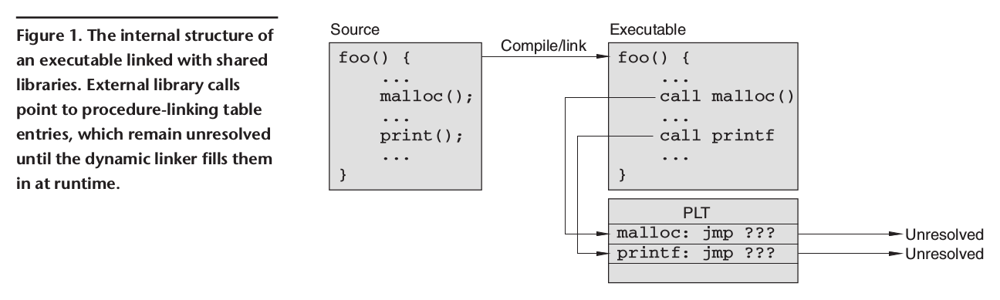
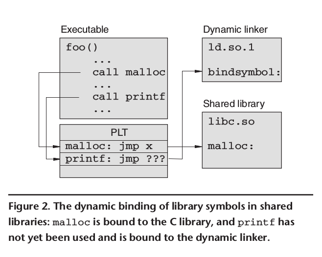
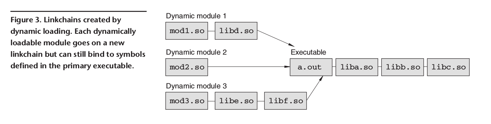

# **共享库和动态装载** #

## **编译器和目标文件** ##

当你编译一个程序时，编译器（compiler）将源文件（source files）转化成目标文件（object files）。每个目标文件包含了源程序中定义，声明语句相对应的机器指令。目标文件被分为了许多个区(section)，每一个区对应了源程序的一部分。例如，C语言程序

```c
#include <stdio.h>
int x = 42;

int main()
{
    printf("Hello World, x=%d\n", x);
}
```

产生的目标文件包含了一个含有程序的机器代码指令的代码区（text section）、一个含有全局变量 `x` 的数据区（data section）、以及一个含有字符串 `"Hello World, x=%d\n"` 的只读区（"read-only" section）。此外，目标文件还包含了一个符号表。符号表记录了源程序中出现的所有符号。查看符号表最简单的方式是使用Unix命令 `nm` ，例如，

```u
$nm hello.o
00000000 T main
         U printf
00000000 D x
```

对于像 `x` 和 `main` 这样的符号，符号表记录了该符号在相应区的相对位置（在这个例子中，`main` 是数据区的第一个函数， `x` 是数据区的第一个变量）。对于其他像是 `printf` 的符号，在符号表中被标记为未定义，意味着在源程序中，虽然他被使用了，但是并未被定义。

## **链接器和链接** ##

为了得到可执行程序，链接器（linker， 例如， ld）需要得到目标文件和库。链接器的基本功能是将符号的名字绑定到内存的地址。为了完成任务，链接器首先扫描目标文件并且将所有目标文件中的区连接成一个大的文件（所有目标文件的代码区被连接起来，数据区和其它的区也被连接起来）。然后，在生成的文件上进行第二次扫描。每个目标文件都包含了一个可重定向列表，它记录了符号的名字和该符号在目标文件中的偏移量。例如，前面例子的重定向表看起来像是这样：

```u
$ objdump -r hello.o

hello.o: file format elf32-i386

RELOCATION RECORDS FOR [.text]:
OFFSET    TYPE       VALUE
0000000a  R_386_32   x
00000010  R_386_32   .rodata
00000015  R_386_PC32 printf
```

## **静态库（static libraries）** ##

为了使程序模块化，增强可重用性，库通常包含了通用的函数。传统的库是一个 `archive` (.a文件)，通常被这样创建：

```unknow
$ ar cr libfoo.a foo.o bar.o spam.o ...
```

得到的 `libfoo.a` 文件是一个*静态*链接库,它的结构仅仅就是将一系列原始的目标文件放在了一起并加上了一个用于快速访问符号的表。
当静态链接库用于链接时，链接器扫描这个库并且将被源程序引用到的所有代码和数据添加进来。链接器忽略掉库中未被引用到的符号，当发现有重复定义的符号时，产生一个错误。

许多编译器提供了一个预编译指令可以将某个符号声明为 `weak` 。例如，下面的代码声明了一个函数，链接器只会在它还没有在任何地方被定义的情况下才会将它包含。

```c
#pragma weak foo
/* only included by linker if not already defined */
void foo()
{
    ...
}
```

你可以使用 `weak` 预编译指令来强制让链接器忽略一个无法解决的符号，例如，如果你写了下面的程序

```c
#pragma weak debug
extern void debug(void);
void (*debugfunc)(void) = debug;
int main()
{
    printf("Hello, world\n");
    if(debugfunc) (*debugfunc)();
}
```

不论 `debug` 是否被任何目标文件定义，程序都能够被成功地编译和链接。如果符号没有被定义，链接器通常将它的值替换为0。所以，这个技术可以用来引用可选的代码而不需要重新编译整个程序。

虽然静态链接库的创建和使用非常容易，但是它存在许多软件维护和资源有效利用的问题。例如，当链接器将一个静态链接库包含到一个程序的时候，它将数据从库复制到了可执行文件中。如果修改了这个库，那么所有链接了这个库的程序都必须重新链接来使改变生效。同样，将库的内容复制到可执行程序中浪费了磁盘和内存空间，尤其是一些相当常用的库（例如C库）。如果Unix上的每个程序都包含了一份C库的拷贝，这些程序的大小会急剧的增加。而且，当许多个程序运行时，用于存储这些相同库函数的拷贝的内存将相当可观。

## **共享库(shared libraries)** ##

为了处理静态链接库的维护和资源问题，许多现代的系统使用共享库(shared libraries)或动态链接库(dynamic link libraries)。共享库和静态库最本质的不同是共享库将实际的链接工作推迟到了运行时。完成这一工作的是一个动态的链接器(dynamic linker-loader)。因此，一个程序和它依赖的库在程序实际运行前都是分离的。

运行时链接使得库的维护变得更容易。例如，如果在公共的库（比如C库）中发现了bug，你可以为它打补丁并更新它而不需要重新编译或链接任何应用程序，这些应用程序总是在它们下一次执行时使用新的库。共享库更精妙的地方是它允许操作系统优化内存的使用。因为库几乎是由通常不会自修改的数据和指令组成，操作系统可以为共享库安排一个只读的内存空间，被进程共享。（使用页共享或其他虚拟内存的机制）。所以，如果大量的进程使用相同的库，操作系统可以只装载一份共享库的副本到物理内存中。这减少了内存的使用并且提升了系统的性能。

在大多数系统中，静态和共享库都由静态链接器处理。例如，一个程序链接了几个不同的库：

```u
$ gcc hello.c -lpthread -lm
```

如果库 `-lpthread` 和 `-lm` 被编译为共享库(通常共享库文件名的后缀为.so)，静态链接器检查未解决的符号并且报告错误。然而并不会将库中的内容复制到可执行文件中，链接器只是将共享库名字的列表记录在可执行文件中。你可以使用命令 `ldd` 来查看库依赖列表的内容：

```u
ldd a.out
libpthread.so.0 => /lib/libpthread.so.0 (0x40017000)
libm.so.6 => /lib/libm.so.6 (0x40028000)
libc.so.6 => /lib/libc.so.6 (0x40044000)
/lib/ld-linux.so.2 => /lib/ld-linux.so.2 (0x40000000)
```

符号在运行时进行绑定，动态链接器按照(link line)顺序查找每一个库，并且使用遇到的第一个定义。如果有多个库都定义了一个相同的符号，那么只有第一个定义被使用。重复的符号定义通常不会发生，因为静态链接器扫描了所有的库并且在遇到重复的定义时会报告一个错误。然而重复定义在以下情况仍可能出现：在被弱定义(weakly defined)时、如果一个已存在共享库的更新引入了新的名字，且它与原有的共享库冲突、或者设置了 `LD_LIBRARY_PATH` 变量改变了 load path。

有趣的是共享库的链接过程发生在每个程序被启动执行的时候。为了使开销最小，动态库使用了 `indirection tables` 和 `lazy symbol binding` 。这使得外部符号引用到一个表项，直到这个符号被使用时才进行绑定。因为大多数程序只使用了库中的一小部分函数，所以这减少了启动时间。
为了实现延迟符号绑定，静态链接器创建了一个被称为 `procedure-linking table` 的 `jump table` 作为最终可执行程序的一部分。接着，链接器处理所有未解决的函数引用,方法是让它们直接指向某个特定的PLT表项。所以，由静态链接器创建的可执行程序的内部结构由图1所示。



为了让 `lazy symbol binding` 在运行时工作，动态链接器清除了所有的PLT表项并把它们指向动态库装入程序中某个特定符号的绑定函数。这个设计的优雅之处是动态链接器在每个符号第一次被使用的时候取得程序的控制权并且处理符号的绑定。当定位到一个符号，链接器就覆盖对应的PLT表项使得后续对这个函数调用时直接进入函数而不是再一次进入动态链接器，图2展示了这一过程。



虽然符号绑定对用户通常是透明的，但是你仍可以通过在启动程序前将 `LD_DEBUG` 环境变量设置为 `bindings` 来观察它，例如

```n
$ LD_DEBUG=bindings python
```

## **库的装载** ##

当一个使用了共享库的程序启动时，程序并没有立刻运程第一条指令。操作系统首先装载并且运行了动态链接器（通常是 ld.so），它首先扫描可执行程序中嵌入的库名字的列表。这些库的名字不是以绝对路径编码的，而只是有一个简单的名字，像是 `libpthread.so.0` 、`libm.so.6` 和 `libc.so.6` ，其中最后的数字是库的版本号。为了找到这些库，动态链接器使用一个可以配置的库搜索路径。这个路径的默认值通常被存放在系统配置文件中，它通常是 `/etc/ld.so.conf`。此外，其它的库搜索目录可能被嵌入在可执行文件或者由用户指的环境变量 `LD_LIBRARY_PATH` 中。

库总是以它们被链接的次序装入。因此，如果你像这样链接你的程序，

```u
$ cc $SRCS -lfoo -lbar -lsocket -lm -lc
```

动态链接器以 `libfoo.so, libbar.so, libsocket.so, libm.so` 的次序装入库。如果一个共享库包含了对其它库的依赖，装入时这些库会被添加到列表的最后。例如，如果库 `libbar.so` 依赖于 `libspam.so`，这个被依赖的库会在所有的库之后被装入，在这里是在 `libc.so` 之后。更精确地，库的装入顺序是从可执行程序直接链接的库开始广度优先地遍历库的依赖。在链接器内部，通过将库放置到一个被称为链接链（linkchain）的链表中来追踪它们。此外，链接器还确保了库没有被多次装入。

因为对目录的遍历是相对较慢的，链接器不会在每次运行时都从 `/etc/ld.so.conf` 中寻找库文件，而是使用一个缓存文件。通常是 `/etc/ld.so.cache`，这个缓存文件是一个库名字到绝对路径的映射。如果你在 `/etc/ld.so.conf` 列出的目录中添加了一个新的共享库，你必须使用 `ldconfig` 命令重建缓存，否则链接器将无法找到它。 使用 `-v` 选项将会产生详细的信息，包含了任何新的或者修改的库。

如果动态链接器无法在缓存中找到一个库，在放弃并返回错误之前，它会尝试在一些系统的库目录中做最后的搜索，例如 `/lib` 和 `/usr/lib`。这一功能通常依赖于操作系统。

你可以通过设置环境变量 `LD_DEBUG` 的值为 `libs` 来得到链接器装入库的详细信息，例如

```u
$ LD_DEBUG=libs a.out
```

当我们开始使用共享库的时候，最常见的的错误是和无法找到库相关的。例如，你像这样创建了你的共享库

```u
$ cc -shared $OBJS -o libfoo.so
```

并且将这个库链接到了可执行文件，在你运行程序时，可能会得到下面的错误信息：

```u
./a.out: err in loading shared libraries: libfoo.so: cannot open shared object file: No such file or directory
```

这个错误通常是因为共享库被放在了一个非标准的位置(没有被定义在 ld.so.conf)。通常的解决方案是设置 `LD_LIBRARY_PATH` 环境变量。然而，设置这个环境变量几乎总是一个糟糕的方法。因为用户设置的环境变量中的库并没有被缓存， `ld.so` 必须在搜索路径的每一个目录中搜索库。所以，几乎你运行的每个需要使用共享库的命令都会让 `ld.so` 做更多的工作。

一个更加严重的问题是这个方法可能会带来库的冲突。一个典型的例子是发生在 `SunOS 4` 中，默认的用户环境变量 `LD_LIBRATY_PATH` 被设置为 `/usr/openwin/lib`。因为 `SunOS 4` 与许多的软件包不兼容，系统管理员通常需要编译 `MIT X`。然而，用户最终得到的是环境变量中的库。

更好地解决方案是使用一些链接选项( `-R -Wl,-rpath` )将自定义的库搜索路径嵌入到可执行文件中，例如,

```u
$ cc $SRCS -Wl,-rpath=/home/beazley/libs -L/home/beazleys/libs -lfoo
```

在这种情况下，程序会在相应的目录下寻找 `libfoo.so` 而不需要设置环境变量。即使使用这种方法，管理共享库也是棘手的。如果你简单的把你的共享库放在 `/usr/local/lib` ，你肯能在更新你的库的时候遇到问题。另外一方面，如果你把它放在其他地方，用户可能将会无法找到他们。

## **库的初始化和终止化** ##

当一个库被装载时，系统可能需要做一些初始的工作。例如，如果一个C++程序有静态构造的对象，它们必须在程序启动前被初始化，

```C++
class Foo{
    public:
        Foo();
        ~Foo();
    ...
}

/* statically initialized object */
Foo f;
```

为了处理这种情况，动态链接器在每个被装入的库中寻找一个特殊的 `_init()` 函数。编译器会生成 `_init()` 的内容以及初始化对象的启动代码和其他运行时的环境。对 `_init()` 函数的调用顺序与它所在的库被装装入的顺序是相反的。（例如，最先被装入的库的 `_init()` 函数在最后被调用）。这是为了确保库之间依赖的正确性。

## **动态装载(dynamic loading)** ##

到目前为止，我们讨论了共享库的底层实现以及它是如何支持程序的动态链接的。动态链接器的另外一个特性是它提供了在运行时访问符号和装载库的API。动态装载机制是实现可扩展系统(extensible systems)以及脚本语言解释器(scripting language interpreters)的关键部分。

通常，动态链接器提供了三个函数来实现动态装载： `dlopen()` (装载一个新的共享库)、 `dlsym()`（在库中查找某个符号） 、 `dlclose()` （关闭一个库并且释放内存）。例如

``` c
void* handle;
void (*foo)(void);

handle = dlopen("foo.so", RTLD_NOW | RTLD_LOCAL);
foo = (void(*)(void)) dlsym(handle, "foo");
...
dlclose(handle);
```

不像标准的链接那样，动态装载的模块和应用程序完全地分离。动态链接器不用它们去解决任何未绑定的符号或进行其他任何常规的程序链接的步骤。

动态链接器装载一个模块和它所有的依赖，就像之前介绍的那样（按照 link line 的顺序装载库，_init() 函数被调用）。同样的，链接器跟踪了之前加载过的共享库并且当再次遇到相同的库时不会重新加载。与静态链接器的主要的不同是，当一个模块被装入，通常延长了一个私有的链接链( *linkchains* )。这产生了一个库的依赖树(由图三所示)。



对于绑定到每一个动态装载的模块中的符号，链接器会在这个模块和以它开始的链接链中的模块进行搜索。此外，链接器也会在可执行程序和它的所有库中搜索。

树结构将会导致每一个动态装载的模块都会有一个它私有的符号空间。所以，如果一个符号的名字在多个可装载的模块中被定义，这些符号可以保持独立并且在执行期间不会引发冲突。类似的，除非程序给链接器传入了特定的参数，链接器不会使用之前加载的模块中的定义来解决新装载模块中的符号。对使用解释型语言的人来说，这一点可以解释为什么两个不同扩展模块中相同的符号不会引起冲突。这也说明了为什么为什么一个扩展的模块不能动态地绑定到其他动态加载模块中的符号。

## **过滤器** ##

动态链接能够完成一些静态链接库无法做到的事情。例如，它可以让你实现一个改变公共库函数行为的过滤器。如果你想要追踪动态内存分配的函数 `malloc` 和 `free`。实现的一个方法是使用动态链接。

```c
/* libmfilter.c */
#include <dlfcn.h>
#include <stdio.h>
#include <assert.h>

typedef void * (*malloc_t)(size_t nbytes);
void *malloc(size_t nbytes)
{
    void *r;
    static malloc_t real_malloc = 0;
    if (!real_malloc)
    {
        real_malloc = (malloc_t)dlsym(RTLD_NEXT, "malloc");
        assert(real_malloc);
    }
    r = (*real_malloc)(nbytes);
    printf("malloc %d bytes at %x\n", nbytes, r);
    return r;
}

typedef void (*free_t)(void *ptr);
void free(void *ptr)
{
    static free_t real_free = 0;
    if (!read_free)
    {
        real_free = (free_t)dlsym(RTLD_NEXT, "free");
        assert(real_free);
    }
    (*real_free)(ptr);
    printf("free %x\n", ptr);
}
```

要使用这个过滤器，这个库需要像其它普通的库一样被包含在链接链中。不同的是，需要为动态链接器设置一个环境变量来使这个库被预先加载。下面的命令解释了使用库预先加载的方法运行来 python 解释器，这使得我们启用了内存分配过滤器。

```u
$ LD_PRELOAD=./libmfilter.so python
```

你可以通过调节链接器将过滤器放在链接链的几乎任何地方。例如，如果过滤器函数被链接到了动态装入的模块，只有这个模块的内存分配函数才会被过滤器处理，而其他的所有动态内存分配函数都没有受到影响。

## **创建共享库** ##

首先，当共享库和可动态装载的模块被编译时，通常需要为编译器指定一些特定的选项(例如 `-fpic,-FPIC,-KPIC` )来生成地址无关代码(*`position-independent-code`*)。当这些选项出现在编译阶段时，编译器生成的代码中的符号可以通过一个间接寄存器（indirection registers？？？）和全局偏移量表来访问。地址无关代码的主要好处是生成的库(包含了机器指令)的代码段可以被快速的重定位到任何内存地址而不需要修改它。这可以加快程序的启动并且对被大量程序共享的库是很有意义的(PIC使得操作系统可以将库重定位到不同的虚拟存储器区域而不用修改其中的指令)。PIC的缺点是它降低了程序的性能(通常5%到15%)。容易被忽视的一点是共享库和可动态装载的模块不一定必须是PIC的。所以如果性能对于一个库或是可动态装载的模块来说是非常重要的，你可以将它编译为非PIC的。然而非PIC的模块需要更长的装载时间因为链接器必须在绑定符号时做大量的工作。
